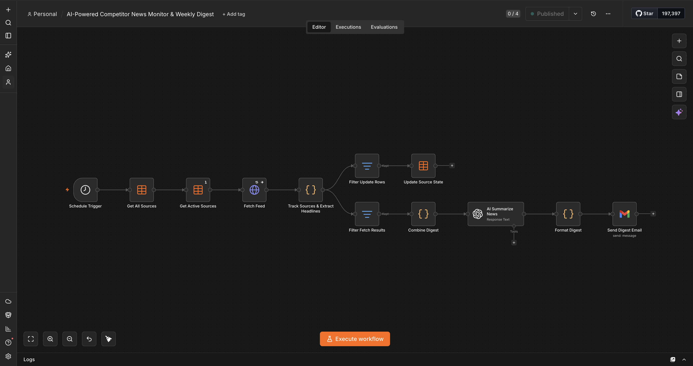

# AI-Powered Competitor News Monitor & Weekly Digest

An n8n system that watches AI/automation industry news, self-heals when a source goes dead, extracts structured facts from every article via a multi-agent LLM pipeline, stores them in a searchable knowledge base, and emails a synthesized weekly digest — no manual upkeep required.

Built as a take-home exercise, then extended past the base spec to explore production concerns: **RSS feeds die and need self-healing rotation; a pile of scraped articles isn't intelligence until it's structured and queryable; and a summarizer with no eval harness is a summarizer you can't trust.**



## What it does

Every Monday at 9am, the main workflow:
1. Reads which of 5 primary + 2 backup news sources are currently active from a Data Table.
2. Fetches each active source's RSS/Atom feed (with retries, timeouts, and graceful failure).
3. Extracts articles published in the last 7 days, tracks each source's health, and rotates in a backup if a source has gone silent for 2 weeks.
4. **Scores and ranks** every article by recency + source-diversity, then runs each through a **per-article extraction agent** (GPT-4o-mini) that pulls out company, event type, dollar amount, and threat level as structured JSON.
5. **Aggregates** those structured facts and sends them to a **synthesis agent** that writes the actual digest — merging duplicate coverage across outlets instead of listing headlines.
6. Formats the result and emails it via Gmail, **and** ingests every extracted article into a Supabase knowledge base for later search.

A second, on-demand workflow exposes that knowledge base over a webhook: `POST /search-news {"query": "..."}` returns ranked, full-text-searched results across everything ever ingested — not just this week's digest.

See [`docs/sample-digest.md`](docs/sample-digest.md) for a real digest from a live run, and [Knowledge base search](#knowledge-base-search) below for a live query example.

## Why this is more than the base assignment

The original brief asked for: a schedule trigger, ≥2 RSS sources via HTTP Request, an AI summarization step, a formatting step, and an email/Slack output. All of that is here, plus four things worth discussing in an interview — each detailed in [`docs/ARCHITECTURE.md`](docs/ARCHITECTURE.md):

1. **Self-healing source rotation.** A Data Table (`source_tracker`) persists per-source health across scheduled runs. A source that goes quiet for 2 weeks gets a backup promoted automatically; it's dropped after 2 more silent weeks, or restored if it recovers first.
2. **Relevance/recency scoring + multi-agent extraction.** Instead of dumping raw headlines at one big summarization prompt, articles are scored and ranked first, then each one goes through a dedicated extraction agent to produce structured facts (company / event type / amount / threat level) before a separate synthesis agent writes the digest. Structured extraction is reusable — the digest is one consumer of those facts, the knowledge base is another.
3. **Supabase knowledge base with full-text search.** Every extracted article is persisted to Postgres with a generated `tsvector` column and a GIN index, queryable via a `search_articles` RPC (`ts_rank`-ordered). No vector DB, no embeddings API cost — n8n's free OpenAI credits don't work through HTTP Request nodes, only the dedicated OpenAI node, which rules out calling an embeddings endpoint directly without a paid key. Full-text search is the right-sized solution for this scale and gets equivalent value for a portfolio demo.
4. **A query workflow + eval harness**, so the knowledge base isn't just a write-only side effect — it's queryable now, and its retrieval quality is checked automatically (see [Evaluation](#evaluation)).

That doc also covers real bugs hit and fixed along the way, including a Data Table race condition and two separate n8n footguns in the query workflow (nodes silently skipped on zero-item input, and a stale unpublished change masking a fix) — worth reading if you want to see the debugging, not just the finished diagram.

## Knowledge base search

```bash
curl -X POST https://htj2.app.n8n.cloud/webhook/search-news \
  -H "Content-Type: application/json" \
  -d '{"query": "raise"}'
```

```json
{
  "count": 3,
  "results": "1. [FUNDING] Travis Kalanick's robotics company raises $1.7B, led by a16z\n   Source: TechCrunch AI | Risk: high\n   ...\n\n2. [FUNDING] Passionfroot raises $15M to expand its B2B creator marketplace to the US\n   ...\n\n3. [FUNDING] Yope raises $12.3M to build a private social network without algorithms or ads\n   ..."
}
```

A query with no matches returns `{"count": 0, "results": "No matching articles found."}` rather than erroring or hanging — see [`docs/ARCHITECTURE.md`](docs/ARCHITECTURE.md) for why that's not the default n8n behavior and had to be fixed explicitly.

## Evaluation

[`eval/eval_search.py`](eval/eval_search.py) is a small retrieval-quality harness: it hits the live search webhook with six fixed queries (five with a known expected article, one designed to return zero results) and asserts the expected company/story appears in the ranked output. Run it against your own deployment:

```bash
WEBHOOK_URL=https://<your-n8n-domain>/webhook/search-news python3 eval/eval_search.py
```

It's deliberately scoped to retrieval (did the right article come back), not digest prose quality — see "What I'd change for production" in [`docs/ARCHITECTURE.md`](docs/ARCHITECTURE.md) for the LLM-judge eval that would come next.

## Repo contents

```
.
├── README.md
├── workflow/
│   ├── competitor-news-monitor.json   # Main pipeline: fetch → extract → synthesize → email → ingest
│   └── knowledge-base-query.json      # On-demand search webhook workflow
├── eval/
│   └── eval_search.py                 # Retrieval-quality eval harness
└── docs/
    ├── architecture-screenshot.png
    ├── ARCHITECTURE.md        # Design decisions, state machine, tradeoffs, bugs hit and fixed, what I'd change for prod
    └── sample-digest.md       # Real digest output from a live run
```

## Running it yourself

1. Import `workflow/competitor-news-monitor.json` and `workflow/knowledge-base-query.json` into an n8n instance (free cloud tier or self-hosted).
2. Create a Data Table named `source_tracker` with columns: `name` (string), `url` (string), `pool` (string), `active` (boolean), `consecutive_silent_weeks` (number), `monitoring` (boolean), `replaced_source` (string), `backup_rank` (number). Seed it with your sources (`pool: primary`, `active: true`) and backups (`pool: backup`, `active: false`, ranked by `backup_rank`).
3. In Supabase, create the `articles` table and `search_articles` RPC function (SQL in `docs/ARCHITECTURE.md`), and grab your project URL + API key.
4. Connect an OpenAI credential, a Gmail (or other email/Slack) credential, and set the Supabase URL/key as HTTP Request headers in both workflows.
5. Publish and activate both workflows — the monitor runs on its weekly schedule, the query workflow listens on its webhook immediately.
6. Point `eval/eval_search.py` at your webhook URL and run it to confirm search is working end-to-end.

## Stack

n8n (Data Tables, Code nodes, HTTP Request, Filter, OpenAI, Gmail, Webhook) · GPT-4o-mini (extraction + synthesis agents) · Supabase Postgres (`tsvector`/`tsquery` full-text search, no pgvector) · regex-based RSS/Atom parsing (no external dependency) · Python eval harness (stdlib only)

---

Built with [Claude Code](https://claude.com/claude-code), driving the n8n browser UI directly — no separate chat-based design tool. Happy to walk through the build/debug session on request.
