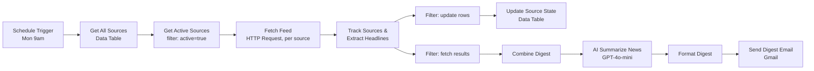
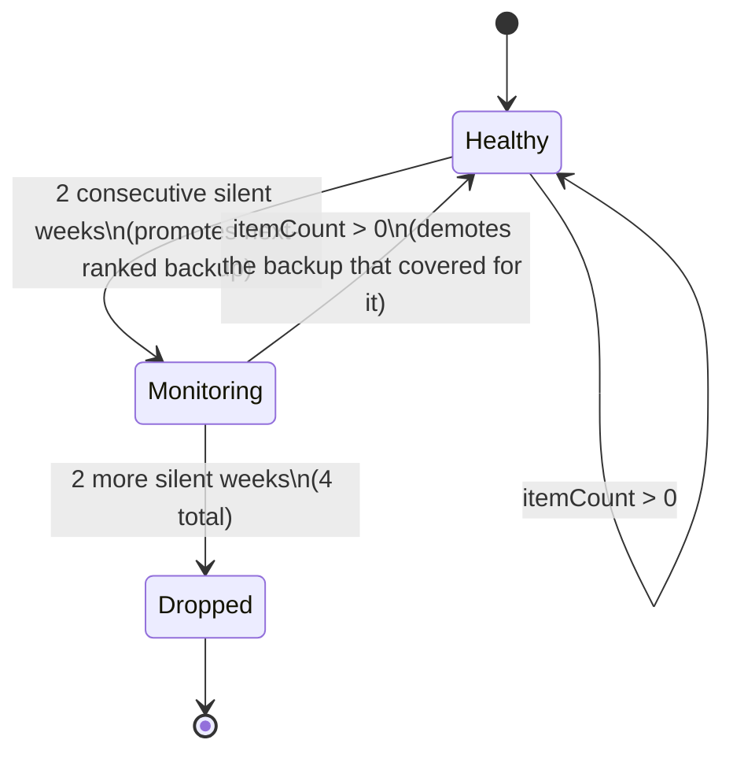

# Architecture

## Pipeline overview

Two branches leave `Track Sources & Extract Headlines` because that node emits two different kinds of items in one array: rows destined for the Data Table (state updates) and rows destined for the digest (parsed headlines). A `Filter` node on each branch separates them by an `isUpdateRow` / `isFetchResult` flag rather than using two separate code nodes, keeping the state computation and the content extraction as a single atomic step per source.

## Why `Get All Sources` feeds `Get Active Sources` instead of both running in parallel off the trigger

Originally both Data Table reads were separate branches off the Schedule Trigger. That's wrong: n8n does not guarantee that two independent branches finish in a specific order, and `Track Sources & Extract Headlines` reads from **both** `Get Active Sources` and `Get All Sources` via `$('NodeName').all()`. Under concurrent execution, `Get All Sources` was sometimes still running when `Track Sources` fired, throwing "node hasn't been executed."

Fix: chain them serially (`Get All Sources → Get Active Sources`) and mark `Get Active Sources` as **Execute Once**, since it would otherwise re-run once per incoming item (7 rows) instead of once per workflow execution. This is a small thing, but it's the kind of race condition that only shows up under real execution and is worth being able to explain — it's the difference between "the workflow ran once and looked fine" and "the workflow is actually correct."

## Self-healing source rotation (state machine)

The interesting design problem: sources go dead (site redesign, feed URL change, temporary outage). A hardcoded list of 5 RSS URLs degrades silently over time. Instead, source health is tracked in an n8n Data Table (`source_tracker`) with one row per source:

| column | purpose |
|---|---|
| `name`, `url` | identity |
| `pool` | `primary` or `backup` |
| `active` | currently being fetched |
| `consecutive_silent_weeks` | weeks in a row with 0 fresh (≤7-day-old) articles |
| `monitoring` | true once a source has crossed the first failure threshold |
| `replaced_source` | if this row is a backup that's live, which primary it's covering for |
| `backup_rank` | order in which backups get promoted |

State transitions, computed once per source per run in `Track Sources & Extract Headlines`:

Design choices worth defending:

- **Why a Data Table instead of hardcoding 7 URLs across nodes?** Rotation logic needs persistent state across scheduled runs (a week ago's silent-week count). A Code node's memory doesn't persist between executions; the Data Table does, and it's queryable/editable outside the workflow (e.g. to manually reset a source) without touching workflow logic.
- **Why 2 weeks before promoting a backup, not 1?** A single missed week is often just an RSS host hiccup, not a dead feed. Two consecutive misses is a much stronger signal, and the backup only needs to be live during the grace window anyway — no cost to activating it slightly early.
- **Why keep the primary "active" (still being fetched) while monitoring?** So it can recover and be restored automatically without manual intervention — the backup and the recovering primary run in parallel for up to 2 weeks, and whichever proves itself back gets kept.
- **Why does the row itself carry `replaced_source` rather than a separate mapping table?** One source has at most one backup covering for it at a time in this design, so a foreign-key-style field on the row is sufficient and avoids a join.

## Deduplication and recency

Two different problems, two different fixes:

- **Recency** is a data problem — solved at the parsing layer. `Track Sources & Extract Headlines` parses `<pubDate>`/`<published>`/`<updated>` from each entry, drops anything older than 7 days, and sorts what's left newest-first before taking the top 6 per source.
- **Cross-source duplication** (the same funding round covered by 3 outlets) is a semantic problem — solved at the prompt layer, not the code layer. Regex can't reliably tell "OpenAI raises $500M" and "OpenAI closes half-billion funding round" are the same story; an LLM can. The prompt explicitly instructs the model to merge overlapping coverage into a single bullet rather than deduplicating by string similarity beforehand.

## Reliability

Every `Fetch Feed` call has a 10s timeout, 3 retries with 1s backoff, and `Continue (regular output)` on error — a single dead feed produces an empty item for that source rather than halting the whole run. Combined with the rotation logic, a feed that's actually gone (not just slow) self-corrects within the state machine instead of needing a human to notice and swap the URL.

## What I'd change for production

- **Persist AI output for evaluation.** Right now there's no ground truth to check summary quality against over time; I'd log each week's digest + source articles to build a small eval set and catch prompt regressions.
- **Alerting, not just continue-on-error.** Silently continuing past a dead feed is right for the digest, but a dropped source (4 silent weeks) should probably notify a human via Slack, not just quietly swap in a backup indefinitely.
- **Move off free-tier OpenAI credits and pin a model version** — the workflow currently runs on n8n's free credits, fine for a demo, not for anything long-running.
- **Multi-channel delivery.** The assignment allows Slack or email; I built email first for OAuth simplicity. Adding a Slack branch is a small addition (one more node off `Format Digest`) if a team actually wants both.
