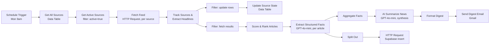
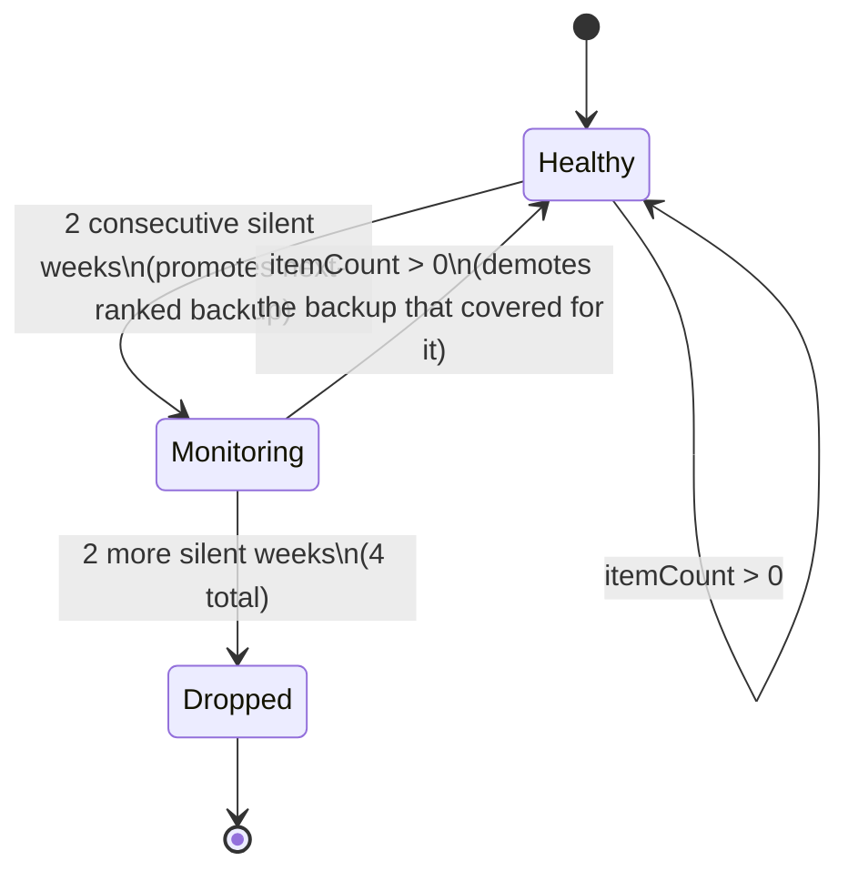

# Architecture

## Pipeline overview



Two branches leave `Track Sources & Extract Headlines` because that node emits two different kinds of items in one array: rows destined for the Data Table (state updates) and rows destined for the digest (parsed headlines). A `Filter` node on each branch separates them by an `isUpdateRow` / `isFetchResult` flag rather than using two separate code nodes, keeping the state computation and the content extraction as a single atomic step per source.

## Why `Get All Sources` feeds `Get Active Sources` instead of both running in parallel off the trigger

Originally both Data Table reads were separate branches off the Schedule Trigger. That's wrong: n8n does not guarantee that two independent branches finish in a specific order, and `Track Sources & Extract Headlines` reads from **both** `Get Active Sources` and `Get All Sources` via `$('NodeName').all()`. Under concurrent execution, `Get All Sources` was sometimes still running when `Track Sources` fired, throwing "node hasn't been executed."

Fix: chain them serially (`Get All Sources → Get Active Sources`) and mark `Get Active Sources` as **Execute Once**, since it would otherwise re-run once per incoming item (7 rows) instead of once per workflow execution. This is a small thing, but it's the kind of race condition that only shows up under real execution and is worth being able to explain — it's the difference between "the workflow ran once and looked fine" and "the workflow is actually correct."

## Self-healing source rotation (state machine)

The interesting design problem: sources go dead (site redesign, feed URL change, temporary outage). A hardcoded list of 5 RSS URLs degrades silently over time. Instead, source health is tracked in an n8n Data Table (`source_tracker`) with one row per source:

| column | purpose |
|---|---|
| `name`, `url` | identity |
| `pool` | `primary` or `backup` |
| `active` | currently being fetched |
| `consecutive_silent_weeks` | weeks in a row with 0 fresh (≤7-day-old) articles |
| `monitoring` | true once a source has crossed the first failure threshold |
| `replaced_source` | if this row is a backup that's live, which primary it's covering for |
| `backup_rank` | order in which backups get promoted |

State transitions, computed once per source per run in `Track Sources & Extract Headlines`:



Design choices worth defending:

- **Why a Data Table instead of hardcoding 7 URLs across nodes?** Rotation logic needs persistent state across scheduled runs (a week ago's silent-week count). A Code node's memory doesn't persist between executions; the Data Table does, and it's queryable/editable outside the workflow (e.g. to manually reset a source) without touching workflow logic.
- **Why 2 weeks before promoting a backup, not 1?** A single missed week is often just an RSS host hiccup, not a dead feed. Two consecutive misses is a much stronger signal, and the backup only needs to be live during the grace window anyway — no cost to activating it slightly early.
- **Why keep the primary "active" (still being fetched) while monitoring?** So it can recover and be restored automatically without manual intervention — the backup and the recovering primary run in parallel for up to 2 weeks, and whichever proves itself back gets kept.
- **Why does the row itself carry `replaced_source` rather than a separate mapping table?** One source has at most one backup covering for it at a time in this design, so a foreign-key-style field on the row is sufficient and avoids a join.

## Deduplication and recency

Two different problems, two different fixes:

- **Recency** is a data problem — solved at the parsing layer. `Track Sources & Extract Headlines` parses `<pubDate>`/`<published>`/`<updated>` from each entry, drops anything older than 7 days, and sorts what's left newest-first before taking the top 6 per source.
- **Cross-source duplication** (the same funding round covered by 3 outlets) is a semantic problem — solved at the prompt layer, not the code layer. Regex can't reliably tell "OpenAI raises $500M" and "OpenAI closes half-billion funding round" are the same story; an LLM can. The prompt explicitly instructs the model to merge overlapping coverage into a single bullet rather than deduplicating by string similarity beforehand.

## Reliability

Every `Fetch Feed` call has a 10s timeout, 3 retries with 1s backoff, and `Continue (regular output)` on error — a single dead feed produces an empty item for that source rather than halting the whole run. Combined with the rotation logic, a feed that's actually gone (not just slow) self-corrects within the state machine instead of needing a human to notice and swap the URL.

## Multi-agent extraction & synthesis pipeline

The base pipeline dumped raw headlines into one summarization prompt. That works for a demo but doesn't scale to "what has this company done in the last 3 months" — the model would have to re-read everything, every time, and there's no structured record to query, chart, or diff against.

Instead, extraction and synthesis are split into two separate agent steps with a scoring/ranking pass in front:

1. **Score & Rank Articles** (Code node, no LLM) — cheap, deterministic pre-filtering. Ranks by recency and penalizes source clustering so one prolific outlet can't crowd out the rest of the digest, before any LLM call is spent on an article.
2. **Extract Structured Facts** (OpenAI, one call per article) — a narrow, single-purpose prompt: given one article, return `{company, event_type, amount, threat_level, one_line}` as JSON. Small, focused prompts are more reliable than asking one model to both extract *and* synthesize *and* format in a single pass — each failure mode (bad JSON, wrong company, missed amount) is isolated to one step and easy to spot-check.
3. **Aggregate Facts** (Code node) — collects the per-article JSON outputs into a single array, the input the synthesis step actually needs.
4. **AI Summarize News** (OpenAI, one call for the batch) — takes the *structured facts*, not raw article text, and writes the "Key Takeaways" / "Why It Matters" digest. Feeding it clean structured input instead of noisy scraped text is most of why the synthesis prompt stays short and reliable.

The same `Extract Structured Facts` output also feeds the Supabase ingestion branch (below) — extraction is done once and reused by both the digest and the knowledge base, rather than re-deriving structured facts separately for each consumer.

**Why per-article calls instead of one batch extraction call?** A single call given N articles and asked to return N JSON objects is exactly the failure mode structured extraction is supposed to avoid — one malformed article can corrupt the whole batch's output, and there's no way to tell which article failed without re-parsing everything. Per-article calls cost more (N calls instead of 1) but each one fails independently and visibly.

## Knowledge base: Supabase full-text search

Every article that goes through `Extract Structured Facts` is also inserted into a Supabase Postgres table so it's searchable outside of any single week's digest email.

```sql
create table articles (
  id            bigserial primary key,
  ingested_at   timestamptz default now(),
  source        text,
  title         text,
  link          text,
  company       text,
  event_type    text,
  amount        text,
  threat_level  text,
  one_line      text,
  search_vector tsvector generated always as (
    to_tsvector('english',
      coalesce(title,'') || ' ' ||
      coalesce(company,'') || ' ' ||
      coalesce(one_line,'') || ' ' ||
      coalesce(event_type,''))
  ) stored
);
create index on articles using gin(search_vector);

create or replace function search_articles(
  query_text  text,
  match_count int default 10
)
returns table (
  id bigint, source text, title text, link text, company text,
  event_type text, threat_level text, one_line text, rank float
)
language sql stable as $$
  select id, source, title, link, company, event_type, threat_level, one_line,
    ts_rank(search_vector, websearch_to_tsquery('english', query_text)) as rank
  from articles
  where search_vector @@ websearch_to_tsquery('english', query_text)
  order by rank desc
  limit match_count;
$$;
```

**Why full-text search instead of embeddings/pgvector?** n8n's dedicated OpenAI node has no Embeddings resource — the only embeddings sub-node is scoped to AI chain workflows, not usable as a general-purpose step here. n8n's free OpenAI credits also only work through the dedicated OpenAI node, not through generic HTTP Request calls to `api.openai.com/v1/embeddings`, and paying for a separate OpenAI key wasn't in scope for this project. `tsvector`/`tsquery` full-text search is built into Postgres (Supabase's underlying database) at no extra cost, handles stemming and `websearch_to_tsquery`'s AND/OR/phrase syntax out of the box, and returns a meaningful `ts_rank` ordering — more than adequate for a demo of this scale. Production-scale semantic search (e.g. "companies doing something similar to X" without shared keywords) would need embeddings; that's the explicit upgrade path, not a gap that was missed.

**A subtlety in the insert step worth knowing about:** the Supabase insert body fields were initially set as `={{ $json.source }}` in the HTTP Request node's text-mode fields. In n8n, the leading `=` marks a field as an expression — writing `={{ ... }}` (leading `=` *and* `{{ }}`) causes n8n to treat everything outside the double braces as a literal string prefix, inserting `=TechCrunch AI` instead of `TechCrunch AI`. The fix is dropping the leading `=` when the field is already in Expression mode (`{{ $json.source }}` alone) — a one-character bug that corrupted every ingested field until caught by inspecting the raw Supabase rows.

## Query workflow: on-demand knowledge base search

A second workflow (`knowledge-base-query.json`) exposes the knowledge base over a webhook, independent of the weekly digest schedule:

```
POST /search-news {"query": "..."}
  → Webhook
  → HTTP Request → Supabase search_articles RPC
  → Code (format results into numbered, human-readable text)
  → Respond to Webhook (JSON: {count, results})
```

Two n8n behaviors caused real bugs here, both worth knowing if you build webhook-triggered search in n8n:

1. **Nodes are skipped entirely when their input has zero items.** When Supabase's `search_articles` RPC returns `[]` (no matches), the HTTP Request node emits *zero* items rather than one empty item — and n8n's default behavior is to skip every downstream node when there's nothing to process. The Code node and Respond to Webhook node never ran, so the webhook just returned an empty 200 with no body instead of a clean "no results" message. Fix: enable **"Always Output Data"** in the HTTP Request node's Settings, which forces it to emit a single (empty) item even on a zero-row response, so the rest of the chain still executes.
2. **That fix introduces its own gap:** the forced empty item is `{}` — no `title`, `source`, etc. — and without handling it, the Code node happily formatted it as "1 result" reading `undefined` for every field. The Code node now filters `$input.all()` down to items that actually have a `title` before deciding whether there are 0 or N real results:
   ```javascript
   const articles = items.map(item => item.json).filter(a => a && a.title);
   if (articles.length === 0) {
     return [{ json: { count: 0, answer: "No matching articles found." } }];
   }
   ```

Both bugs were invisible when testing with a query that had matches — they only surfaced on the zero-result path, which is exactly the kind of edge case an eval harness (below) exists to keep covered instead of relying on manually remembering to test it.

## Evaluation

`eval/eval_search.py` is a small, dependency-free (stdlib-only) harness that hits the live search webhook with six fixed queries — five with a known expected article/company, one deliberately matching nothing — and asserts the right thing comes back:

```
PASS  [stealth endpoint-security launch] query='Glow' count=1
PASS  [AMD's $5B Anthropic infrastructure deal] query='Anthropic' count=2
PASS  [OpenAI/Hugging Face security incident] query='Hugging Face' count=3
PASS  [China open-source models coverage] query='Chinese models' count=1
PASS  [funding-round articles] query='raise' count=3
PASS  [no-match query returns 0, not an error] query='zzz_nonexistent_query_12345' count=0

6/6 cases passed
```

This is a retrieval eval (did search return the right article), not a generation eval (is the digest prose good) — n8n's built-in Evaluations feature is oriented around dataset-driven node-output scoring inside the editor, which is heavier to set up than the value it adds for a single retrieval endpoint at this scale. A standalone script that hits the real webhook is faster to write, faster to run in CI, and — as it turned out — is what actually caught both query-workflow bugs above during testing, before they'd have shown up as a silent production gap.

## What I'd change for production

- **Add a generation-quality eval, not just retrieval.** `eval/eval_search.py` checks that search returns the right articles; it says nothing about whether the digest's synthesized prose is actually good. I'd add an LLM-judge step that scores each week's digest against its source facts for accuracy (no hallucinated numbers) and non-redundancy (duplicate stories actually merged), logged over time to catch prompt regressions.
- **Move to pgvector once semantic search is actually needed.** Full-text search handles "find articles mentioning X" well; it can't do "find articles about something similar to X" without shared keywords. That's the natural upgrade once the corpus is large enough for keyword search to start missing relevant results.
- **Alerting, not just continue-on-error.** Silently continuing past a dead feed is right for the digest, but a dropped source (4 silent weeks) should probably notify a human via Slack, not just quietly swap in a backup indefinitely.
- **Move off free-tier OpenAI credits and pin a model version** — the workflow currently runs on n8n's free credits, fine for a demo, not for anything long-running.
- **Multi-channel delivery.** The assignment allows Slack or email; I built email first for OAuth simplicity. Adding a Slack branch is a small addition (one more node off `Format Digest`) if a team actually wants both.
- **Auth on the search webhook.** It's currently open — fine for a portfolio demo, not for anything with real data behind it.
- **Move the Supabase key into n8n's credential store.** It's currently a literal header value on the HTTP Request nodes (`apikey` / `Authorization: Bearer ...`) rather than a stored credential, which is why the exported workflow JSONs needed the key scrubbed out before committing to this repo. n8n supports generic "Header Auth" credentials for exactly this case — same header, but the value lives encrypted in n8n's credential store instead of in the workflow definition.
